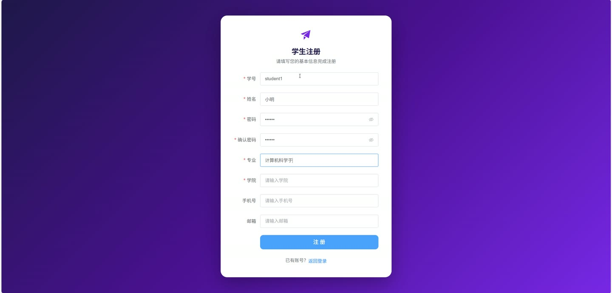
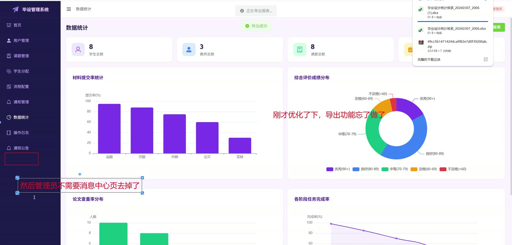
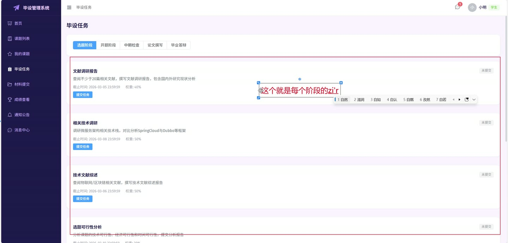
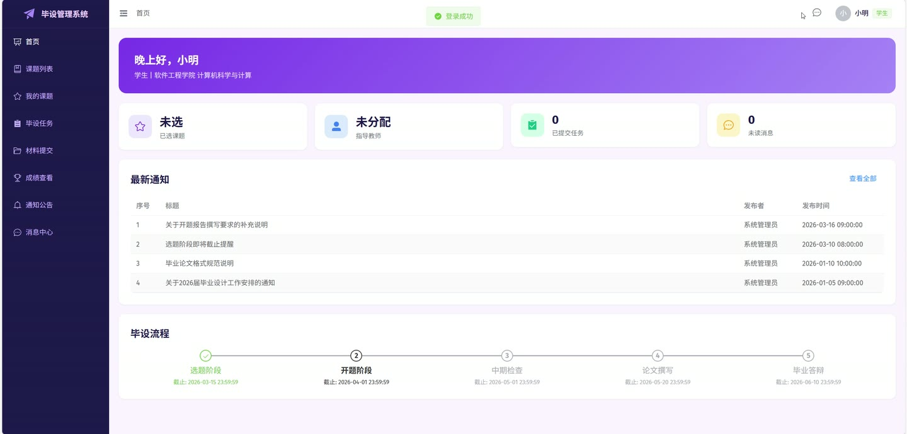
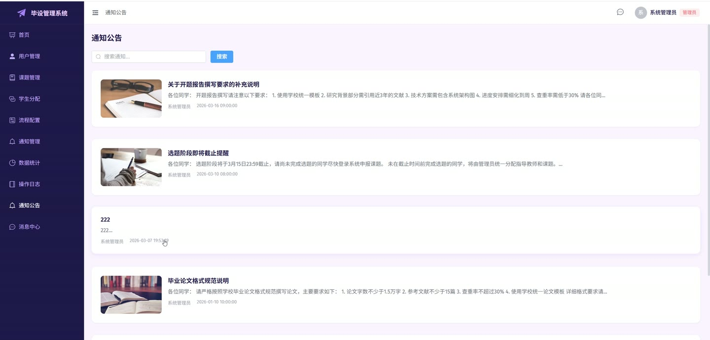
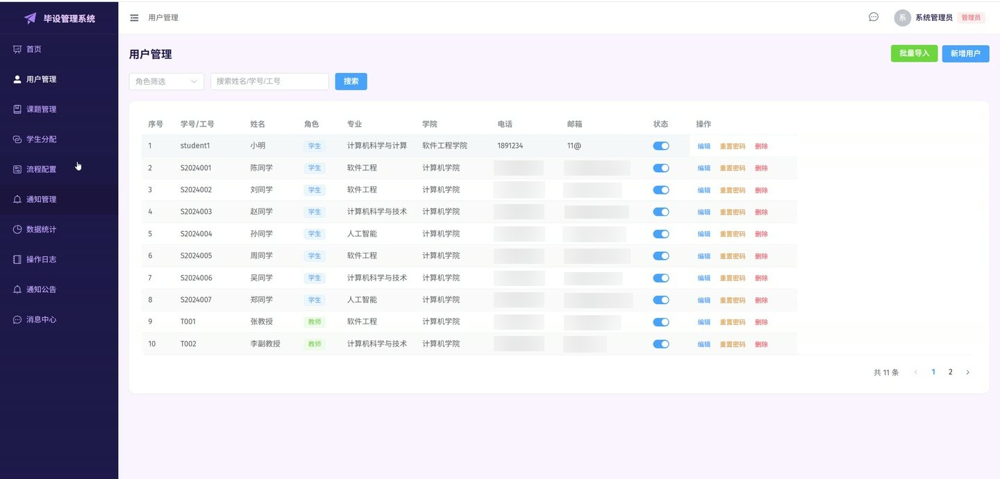

# (附文档)Springboot3+Vue3+MySQL 毕业设计过程评价与管理系统

**技术栈**：Springboot3、Vue3、MySQL

### 系统简介

本系统是一套基于 SpringBoot3 + Vue3 + MySQL 的过程评价与管理系统，采用前后端分离架构。系统包含管理员、教师、学生三种角色，覆盖从课题发布、学生选题、过程材料提交、子任务管理、成绩评定到数据统计与报表导出的完整管理流程，并集成了 DeepSeek AI 对话与查重辅助功能。
 
### 核心功能
 
### 普通用户端

 
- 登录与注册：输入用户名和密码进行登录；学生可通过注册功能创建账号。 
- 修改密码：在个人中心输入旧密码和新密码完成密码修改。 
- 查看个人信息：获取当前登录用户的基本信息（姓名、角色、学院、专业等）。 
- 更新个人信息：修改个人资料（姓名、学院、专业、头像等）。 
- 浏览通知公告：分页查看已发布的系统通知，支持按关键词搜索标题与内容。 
- 查看通知详情：点击通知标题查看完整公告内容，显示发布人姓名与发布时间。 
- 发送私信：向其他用户（教师/同学）发送即时消息。 
- 查看聊天记录：与指定联系人的双向消息历史，自动标记对方消息为已读。 
- 联系人列表：按最后聊天时间排序显示所有联系人，并展示未读消息数量。 
- AI 智能对话：在聊天或帮助页面输入问题，调用 DeepSeek 大模型返回回答。
 
### 学生端

 
- 申报课题：在课题列表中选择教师发布的课题进行申报，提交后等待教师审核。 
- 自主申报课题：学生自行填写课题名称、方向、难度等信息，提交后等待教师审核。 
- 查看课题申报记录：分页查看自己的课题申报历史及审核状态。 
- 提交汇总材料：按流程节点（如开题、中期、）提交标题、说明及附件，系统自动触发 AI 查重。 
- 撤回待审核材料：对状态为“待审核”的汇总材料执行撤回操作。 
- 查看材料审核结果：查看材料的审核状态、评分、审核意见及驳回理由。 
- 提交子任务：针对教师发布的子任务（如文献综述、代码片段）提交内容或附件。 
- 撤回子任务：对状态为“待审核”的子任务提交进行撤回。 
- 查看子任务完成进度：按流程节点查看自己各子任务的完成状态与评分。 
- 查看阶段成绩：查看自己在各流程节点的阶段成绩及综合评价。 
- 查看最终成绩：查看最终总成绩与评语。 
- 查看子任务评分明细：查看某阶段下各子任务的具体评分详情。 
- 查看指导教师：获取当前分配的指导教师信息。 
- 学生端首页统计：查看个人材料提交数、待办事项、最新消息等概览。
 
### 教师端

 
- 发布课题：填写课题名称、研究方向、难度、可指导人数等信息发布课题。 
- 管理课题：编辑或删除自己发布的课题，查看课题申报人数与状态。 
- 审核课题申报：审批学生申报或自主申报的课题，填写审核意见并设置为通过或驳回。 
- 查看课题申报列表：分页查询所有课题申报记录，可按课题、学生、状态筛选。 
- 添加子任务：在指定流程节点下创建子任务（如文献综述、实验报告），填写任务名称、内容、截止日期。 
- 编辑/删除子任务：修改子任务信息或删除不再需要的子任务。 
- 审核子任务提交：查看学生提交的子任务内容，给予评分（分数）和审核意见，状态可设为通过或驳回。 
- 查看子任务提交列表：分页查询所有子任务提交记录，按子任务、学生、状态筛选。 
- 审核汇总材料：查看学生提交的汇总材料，填写评分、审核意见及驳回理由（多选），状态设为通过或驳回。 
- 录入阶段成绩：为指定学生在某流程节点录入阶段成绩和综合评价。 
- 录入最终成绩：为指定学生录入最终总成绩和评语。 
- 自动计算综合评价：根据子任务评分自动计算某学生的阶段综合评价成绩。 
- 查看成绩统计：查看自己所带学生的成绩分布、平均分等统计图表。 
- 确认/退回学生分配：对系统自动或手动分配的学生进行确认或退回操作。 
- 查看指导的学生列表：查看当前教师指导的所有学生信息。 
- 教师端首页统计：查看指导学生数、待审核材料数、待评分任务数等概览。 
- 发送消息：向自己指导的学生发送通知或沟通消息。
 
### 管理员端

 
- 用户管理：分页查询所有用户（按角色/关键词），支持新增、编辑、删除用户。 
- 重置用户密码：将指定用户的密码重置为 123456。 
- 修改用户状态：启用或禁用用户账号（状态 1/0）。 
- 批量导入用户：通过上传 Excel 文件批量导入学生/教师账号。 
- 流程节点配置：添加、编辑、删除流程节点（如开题、中期检查、），支持排序。 
- 查看流程节点列表：按排序顺序查看所有已配置的流程节点。 
- 手动分配学生：将指定学生手动分配给某位教师，并关联课题。 
- 自动分配学生：系统根据课题申报情况自动完成学生-教师分配。 
- 查看师生分配关系：分页查询师生分配记录，按教师、学生、状态筛选。 
- 删除分配记录：移除已存在的师生分配关系。 
- 发布通知公告：填写标题和内容发布系统通知，所有用户可见。 
- 管理通知公告：编辑或删除已发布的通知。 
- 查看操作日志：分页查询系统操作日志，按模块、操作类型、关键词筛选。 
- 清空操作日志：一键清空所有历史操作日志。 
- 管理员首页统计：查看学生总数、教师总数、课题总数、待审核申报数、已分配学生数等概览。 
- 全院数据统计：查看全院维度的课题、成绩、材料提交等汇总数据。 
- 导出统计报表：一键导出包含总体概况、学生成绩明细、课题信息、材料提交明细、师生分配关系、查重率分布等 6 个 Sheet 的 Excel 报表。 
- 文件管理：上传单个/多个文件，删除已上传的文件。
 
### 技术栈

 后端框架Spring Boot 3.x ORMMyBatis-Plus 权限/认证JWT Token + 自定义注解 @Log 前端框架Vue 3 状态管理Pinia 构建工具Vite 数据库MySQL 8.x AI 集成DeepSeek API（对话与查重） 文件上传本地文件存储 + MultipartFile 报表导出Apache POI (XSSFWorkbook) HTTP 客户端OkHttp 工具库Hutool、Jackson、Lombok
 
### 交付内容

 
- 后端完整源码 
- 前端完整源码 
- 数据库初始化脚本 
- 万字文档

## 界面展示

---

## 获取完整源码 + 万字文档

本仓库为项目介绍页。**完整前后端源码、数据库初始化脚本、万字项目文档**，请加微信 `kangkangcode`，或访问 [codekk.top](http://codekk.top) 获取。

可作课程设计 / 毕业设计参考，支持远程部署调试。